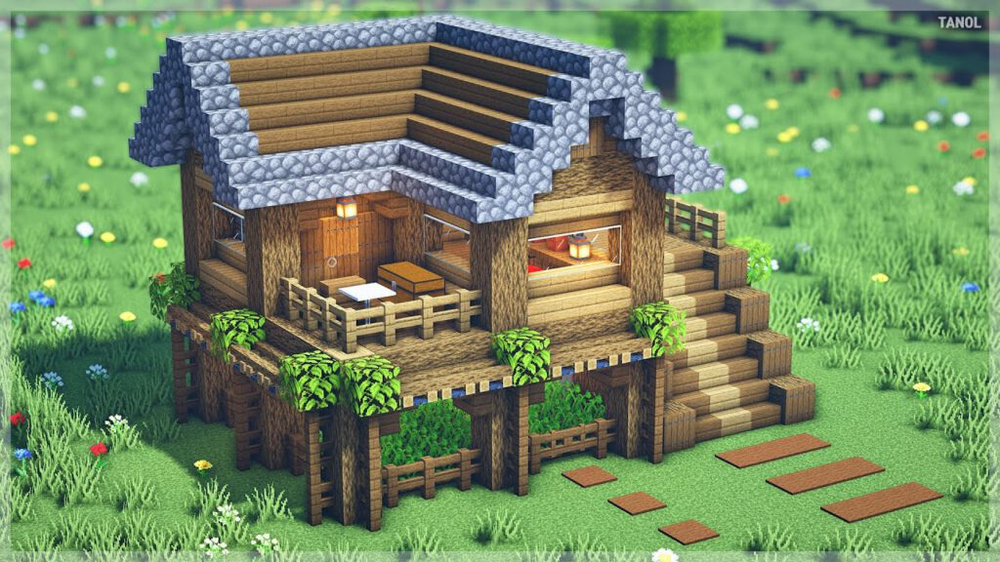

# OPINION: Emergence in games

In my opinion, Emergence is a very important concept in game development.<br>
Especially in indie game development; as emergence can provide a lot of content without much work.

In fact, I'd go as far to argue that having emergent systems that the player
can interact with, is *the* most important thing in game development.
Not because it drives success; (it does) but rather, because it's the thing that
many game developers overlook / don't care enough about.

But... what *IS* Emergence in a game context?<br>
It's quite hard to define!

So in this blog post, I'll examine a few examples of good emergence from existing games,
and cherry pick my favorite and least favorite examples.

Keep in mind, this is all just my opinion!

Before we dive into it, though; we need to do some housekeeping.

--------------------------

## Lets discuss the golden rule:
Chess is a highly-emergent game.<br>
Because of this, it has existed for thousands of years, and is one of the most popular
games played by people to this date.


But chess on it's own is not very interesting.<br>
Imagine if you were playing 1-player chess, where you just moved the pieces around.
Would that be very fun? (No. And I know it's not fun, because nobody does it.)<br>
I'm using this example, because I want to clarify something important, which I call
"The golden rule":

- *Emergence on it's own won't cut it. You need Emergence, combined with the human mind.*

Suddenly, if you have another player on the other side of the board,
plotting their moves, and attempting to discover your tactics,
you have a very interesting and complex game.

To put it elegantly, emergence in games is not about creating "cooler" or "better" rules;
rather, it's about allowing the player to create their own gameplay THROUGH the rules.

When chess was first created, I can almost guarantee that the Fried-Liver attack did not exist.
Humans created this gameplay element, *using* the emergent ruleset of chess.

--------------------------

Now, chess is a simple example that's easy to grasp, but also a very basic, and awkward example.
Since a lot of the gameplay is not actually created by the player, but rather, by the opponent.

So lets look at another game that allows it's players to create gameplay value, 
without the need for an opponent:

## *Minecraft.*
Minecraft is a ground-breaking, brilliant game.
Before minecraft, there was no real sandbox game available to the casual gamer.

It was so ahead of it's time, and it's success kinda speaks for itself.

What I'd like to look at though, is it's emergent game rules.
Now, there are 2 distinct examples that I want to pick apart here;
lets not get lost in the weeds though. The two distinct examples are:

- Emergence in building
- Emergence in engineering

#### Emergence in building:
In minecraft, many players just want to build cool shit.
I'd argue that *most* players want to do this, actually.

- Take a look at this image:



To a minecraft player, this will look quite normal.
It's a little cottage, with a cute little wooden roof and windows. <br>
On the right are some nice stair blocks leading to a deck.

But lets slow down a bit; take a look at the sloped roof.
On the roof of the house are ALSO stair blocks, lined up to produce a nice slope.

In Minecraft, the same blocks can be used in different ways to allow the builder 
to express their creativity to a higher degree.

Look again, at the windows, and the door. Stairs are being used AGAIN,
this time, to provide some depth to the walls, and to provide a rounded entrance.
Remember: stairs are just one block type. Players only need to remember one recipe to
create all this wonderful stuff. Isn't that brilliant? 

One block on it's own does not do anything interesting, but multiple blocks
together, *combined* with the human mind, allows the player to create gameplay 
opportunities for themselves.


#### Emergence in engineering:

This is a more interesting aspect, but it also gives way to a more important concept that I
want to talk about: ***Simplicity.***

If you are a minecraft player, you have probably seen those videos of huge industrial
mob farms that automatically farm resources for you.

(If you haven't, quickly google "efficient iron farm" on youtube, you'll see a bunch of unique designs)

For a second though, lets stop to ponder. Did the developers of minecraft intend for there
to be massive, industrial item-farms?
Maybe! But whatever the case, they *definitely* did not conceive the designs.

I'll run briefly how a basic mob-farm may work, by breaking down the systems:
- Water pushes entities in it's flow direction
- Mob entities spawn in the dark
- Mob entities drop item entities on death
- Entities with health take damage if they fall a big distance

With these rules, players can create a chamber that automatically spawns mobs,
pushes them to a cliff, kills the mobs, and transports the dropped items to a safe collection point.

(Also note that these rules are all independent of one another.
Any one of these rules may be used in another context independently to produce gameplay.)

These farms are not created because the minecraft devs wanted you to create them.
They are created because the players have a goal: "Get resources".
And with this goal, the players can bend the world to their will, because the rules are emergent enough
to allow it.

But, we are missing something important. The vast majority of players won't build these giant,
complex, intricately engineered item farms.

Why not?

In my opinion, it all comes down to *Simplicity.*  If the rules become too hard to grasp, then a
bunch of players are cut off, either because they aren't patient enough, or they aren't willing
to invest the mental energy in devising an idea that takes advantage of the rules.
These massive, industrial farms are not simple to make; they require quite a deep understanding
of the game systems, and they definitely require a lot of human creativity.

Remember the golden rule: 
- *Emergence on it's own won't cut it. You need Emergence, combined with the human mind.*

Players that aren't engaged enough to invest their time and energy into understanding the systems
will fail to create these gameplay opportunities.

Hence, it's important to ensure that emergent rulesets are sufficiently *simple*, so our players can
take advantage of them without much mental energy.


#### Is Minecraft cheating?

Okay, we get it. Minecraft is a brilliant game.<br> 
And it's success shows it.

But doesn't it cheat? Minecraft is a sandbox game; of course it's going to be highly emergent
when the player can literally alter the world.

Yes, that's true; sandbox games *are* naturally emergent.
But minecraft still does it the best, IMO.<br>
There are many minecraft-like games that have been no-where near as successful,
because they don't provide the player with emergent gameplay opportunities like minecraft does.

A few examples of this are:
- Eden
- Cube World
- Eco

I haven't been able to find any "automatic farm" designs for any of these games;
(Or at least, no designs that are out of scope of what the developer intended.)

All existing designs for stuff lay within the developer's closed vision for gameplay,
which is a sign of insufficient emergence.

-------------

Okay, cool.

So what's an example of emergent gameplay that's NOT within a sandbox context?

## Emergence in the Binding of Isaac

Yup yup, it's this game.
If you play roguelikes, you probably saw this from a mile away.

The Binding of Isaac has seen years and years of praise, and is likely the
most successful indie roguelike game to ever exist.

But to understand what makes Isaac fun, we need quickly understand the core game:

- Player starts a run with randomly generated levels
- Player fights her way through levels, achieving upgrades and items
- Player either dies, or beats the game in roughly 40 minutes
- (Repeat, ad infinitum)

A lot of the "fun" in Isaac comes from the player's ability to obtain synergies
between items, and make themselves powerful each run.

But how are synergies done? There are hundreds (if not thousands) of roguelikes on the
market that have synergies between items. What does Isaac do that's special?

Lets create two imaginary items, `Item X` and `Item Y`.

Now lets assume that items X, Y apply some effect to the player.
In this example, it doesn't matter too much what they actually do;
just know that they do *something*.

As a game designer, we might want to add a synergy.
Thus, we hardcode a little rule:
```c
Item X synergizes with Item Y
```
(This could be adding more attack damage when both items exist, for example.)

But this is terrible.<br>
Why? Why is this terrible?

This is terrible, because it's a very closed ruleset.
If another item comes along, (i.e. `Item Z`) it will not be able to mesh
creatively with the existing rules.

It would be much better to have a system that tags into existing mechanics.
Lets imagine we have a game mechanic "M".
Our setup could look like:
```c
Item X: provides "M"
Item Y: adds attack damage equal to "M"
```

Suddenly, we have a more interesting ruleset on our hands, that provides
the *exact same* synergy.

*Why is this better, though?*<br>
Well, if we create another item, `Item Z`, we can mesh Item Z with the existing
mechanic `M`:
```c
Item Z: doubles "M" when the player is on low health.
```

Suddenly, we have potential for a synergy between low-health playstyles,
`Item Z`, and `Item Y`. Isn't that brilliant?

The Binding of Isaac does this kind of thing really *really* well,
by having virtually all passive items tag into game mechanics and mesh with
other items by proxy.

Here are some 2-item synergies, with the helping mechanic listed too:

- Host hat: immune to explosion damage
- Kamikaze: creates a damaging explosion next to the player
- MECHANIC: Explosions

- Brimstone:  slow fire rate, with massive damaging lazer beam
- Tammys head:  releases a burst of shots
- MECHANIC: Fire rate

- Lump of coal:  Shots deal extra damage based on distance travelled
- Tiny planet:  Shots orbit, travelling for way longer
- MECHANIC: Shot range / shot trajectory

Each of these examples provides a cool synergy that is good for the player.

What's important, is that none of these items directly interact with each other.
Rather, the items mesh with *an existing mechanic.*

Which means that other items can affect these items too, providing much more interesting gameplay.


## Emergence as a natural phenomenon

Sometimes, instead of programming game rules directly, it might be best
to work backwards.

Take a mental note of the intended behaviour,
and develop natural rules to produce that behaviour in the game.

For example, instead of doing this:
```
when bullet entity collides ---> deal damage
```

You should do this:
```
fast moving, sharp entities ---> deal damage
bullets ---> are fast and sharp
```

Note that this is also how the real world works.
The real world doesn't care if something is a "bullet", or a "train".
If you get hit by either one at great speeds, you will probably die.

So the best way to describe this kind of idea, is representing the game
in a more natural format.

This is both a bad idea, and a good idea.

-----------------

- *Why is natural emergence a good idea?*

Well, in future, players might be able to come up with creative damage devices.
Such as custom mechanical cannons, or lining up shrapnel near
explosives to kill enemies.

It opens the game rules, and allows players to think outside of the developer's
box. Remember; it's all about allowing the player to create their own gameplay.
If we provide natural, emergent rules, this is much more viable.


- *Why is this a bad idea?*
Lets talk about what I call the "Friendly-Fire dilemma".

#### The Friendly-Fire dilemma

Emergent systems are not without costs;<br>
The biggest cost of an emergent game system is the loss of developer control.

Lets create a quick example example scenario, with our fast moving bullets:
```
Fast moving object --> deals damage
Bullet is fast moving --> bullet deals damage
Players shoot at zombie, miss and hit friend --> Player kills friend!
```

Suddenly, we have a situation where players can accidentally shoot
and kill their friends, which is quite bad.

And we can't change this, since it's part of our game rules that fast moving
objects deal damage!

To put it frankly, this is the cost that we pay for emergent systems.
Sometimes our rules will have unintended consequences that we cannot solve without
fudging with the rules in an unnatural, non-emergent fashion.

Thankfully, this isn't a big deal generally; as players will actively work
*WITH* the rules to achieve their goal, not against them.<br>
If shooting team-members hurts the chances of meeting a goal,
players probably won't do it.

Here's a little equation that demonstrates the whole idea quite nicely:
```
Emergence * DeveloperControl  =  CONSTANT
```
With every unit of emergence we add, *by nature*, we lose control as a developer.

Similar to John Conway couldn't control the shape of Gosper's Glider gun,
and similar to how the creators of Chess couldn't control how the Sicilian defence worked,
as a developer, you lose control of a game when you create emergent rulesets.

As I said, this isn't a bad thing most of the time. It's mostly something to keep in mind. 

----------------

# One final (special) example:

- ***Dwarf Fortress.***

I don't think many people would call me crazy if I said that Dwarf Fortress
has the best emergent game systems out of any game ever made. 
And I could ramble on about the systems and how naturally emergent they are, but, quite frankly,
it would be a waste of time. There are enough articles on this already. :^)

What I want to address actually, is it's popularity.<br>
If this game has such amazing, emergent systems, then why isn't it more popular?

It has 18000 reviews on steam, (indicating over 1 million downloads, for a revenue of roughly 30 million dollars,
which is very successful) but this game's success pales in comparison to something like Minecraft,
despite the fact that it was created before Minecraft.

In my opinion, it comes down to **broad appeal**.<br>
Most of DF's gameplay does not cater to the casual gamer, but rather, to the nerd.
DF's controls and systems are very hard to use, and thus,
DF caters to the people who are patient; the people who care enough to learn a complex set of commands from the get-go.
Likewise, the game is singleplayer; which means that it's not a game that can be learned through friends.

With this, DF hits a much tighter niche, and pushes away a lot of the
broader audience.

If the Adams brothers focused much more on creating a noob-friendly user-experience when starting out, 
then I suspect that DF would be a lot more popular today.


----------------

## TO CONCLUDE:

It's not about creating "more interesting" gameplay, or providing
a "more in-depth" experience for the player.

Rather, it's about providing the player with sufficiently emergent rules, such that they can
create their OWN gameplay.

- *It's not about the rules. It's about how the human mind meshes with the rules.*

Thanks for reading! 


# GOLDEN RULE:
"Emergence" on it's own won't do anything.
You must have emergence, *combined with the human brain.*

In other words: give the players the tools, and they will provide
interesting gameplay for themselves.


# Interpretation of Emergence in the UMG Ecosystem:
Don't create systems that provide gameplay;<br>
Instead, create systems that provide rules.<br>
Gameplay is then generated by the players, when they mesh with the rules.


----------------------

**EXAMPLE A:**<br>
Damage.  Don't make it so "when bullet collides, deal damage"
Make it so "fast moving objects deal damage"
That way, the damage system can be reused.<br>
*Why is this a good idea?*<br>
Well, in future, players might be able to come up with creative damage devices.
Such as custom mechanical cannons, or lining up shrapnel near
explosives to kill enemies.


**EXAMPLE B: Roguelike synergy:**<br>
Don't just make it, "X synergizes with Y"
Make it so "X provides M"  and  "Y does something with M"
This way, it could be implied that "X synergizes with Y"<br>
CONCRETE EXAMPLE:
- A throwable potion duplicates entities.
- Engineer class produces turrets that shoot.
- **Combined together, the engineer can double it's damage by duplicating turrets**
*Why is this a good idea?*
The throwable potion that duplicates entities could be used in other creative,
unintended ways that provides interesting gameplay.
For example, players could drop their money on the ground and duplicate it.


----------------------------------------------------------


### Better, more complicated example:
#### (from dwarf fortress)

- Poison is spilled all over the ground

- Cats walk on the poison, poison goes on their legs

- Cats groom themselves, and ingest poison

- Cats die


^^^^ This is a great example of emergent gameplay.
These are the simple rules required:::

- Liquid can be on the ground
- Small animals walking on the ground get covered in liquid
- When grooming, cats remove liquid from their bodies and ingest it
- Poison kills things that ingest it


### 2nd example:
## Minecraft automatic wheat farm
- Villages plant crops
- Minecart hoppers pick up items
- Water destroys crops
- Dispenser activates bucket
- Water can be stored in a bucket
- Crops grow over time

Comining these ^^^ things, we get emergent behaviour, and are able to 
make an automatic villager crop farm.


# OLD NOTES::: THESE NOTES ARE OUTDATED.
### 3rd example:
## Use this for "GRO", or some other sandbox game.

Creating an item sorter:


### Mechanical nodes:
    transfer pulses (like wireworld automata)

### Sucker/Blower
    Blows away stuff, or sucks in stuff, depending on it's mode.
    Each sucker has 5 slots, that determines what items it can blow away.
    An item sorter with no items will blow/suck ALL items.

### Item pipe
    Transfers items through a pipe.
    Pipes are one directional.

    pipes leading into a chest will deposit items into a chest
    pipes leading AWAY from a chest will take items from that chest

    Pipes can be toggled on/off with mechanical pulses.
    (they also can be toggled manually.)

### Deployer
    When a deployer recieves a pulse, it attempts to "Use" any item that
    is in it's inventory.


An item sorter can be created by blowing items away into pipes,
and leading those pipes into chests.

