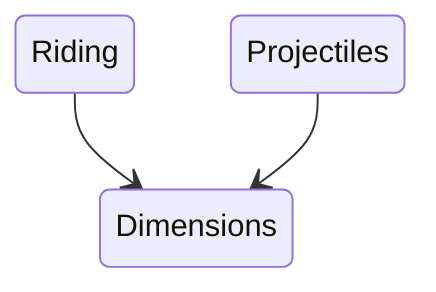

# Arguments for and against versioning

In Untitled Mod Game, there is going to be no versioning of mods. 
This is a very bold call, and it sounds stupid at face value.
But please, hear me out! 
This lil article will explain my thought process.

---------------

In pretty much all software packaging systems, software has
version information. 
Versioning is great, because it allows introducing breaking changes to software without harming existing users.

And that's pretty much the main "point" of versioning, is dealing with breaking changes. 
If users don't want to deal with breaking changes, they can just stay on an older version.

Pros of versioning:
- Allows developers to break compatibility in favour of better features or removal of tech debt
- Users can use older versions if they want, granting a lot more freedom

Cons of versioning: (no major cons, really)
- Userbase can become fragmented

---------------

Now, before we start, I'd just like to note,
I'm **100% FOR** the use of versioning, and I think you'd have to be an idiot not to see the value in it for 99% of situations.

But UMG is a bit special in what it's trying to achieve. 
There's a very concerning situation where versioning could yield to a bit of a mess, I'll explain it below.

--------------------

Let's do a thought experiment, lets assume that mods ARE versioned in UMG.

As discussed in [my other article](umg_tech_details.md), a central goal of the UMG ecosystem is to ensure hyper-compatibility between mods.

I want to be able to load the `ridable` mod, and have it work fully with the `projectiles` mod. That way, I can ride my horse off into the sunset, weilding my minigun, and rocking a cowboy hat.

Ideally, the `projectiles` mod should not need to care about the `ridable` mod. In fact, both mods should not know about each other, since they are unrelated. 
However, both mods will still need to tag onto other mods.
Both the `projectiles` mod, and the `ridable` mod will need the `dimensions` mod to be loaded, so that they can fudge around with what dimensions steeds are in, and what dimensions projectiles are spawned in.

And lets assume that there was a breaking change in the `dimensions` mod, from version 0.9 to version 1.0, which overhauled the way entities are stored inside of dimensions, and changed a few things of the API.

